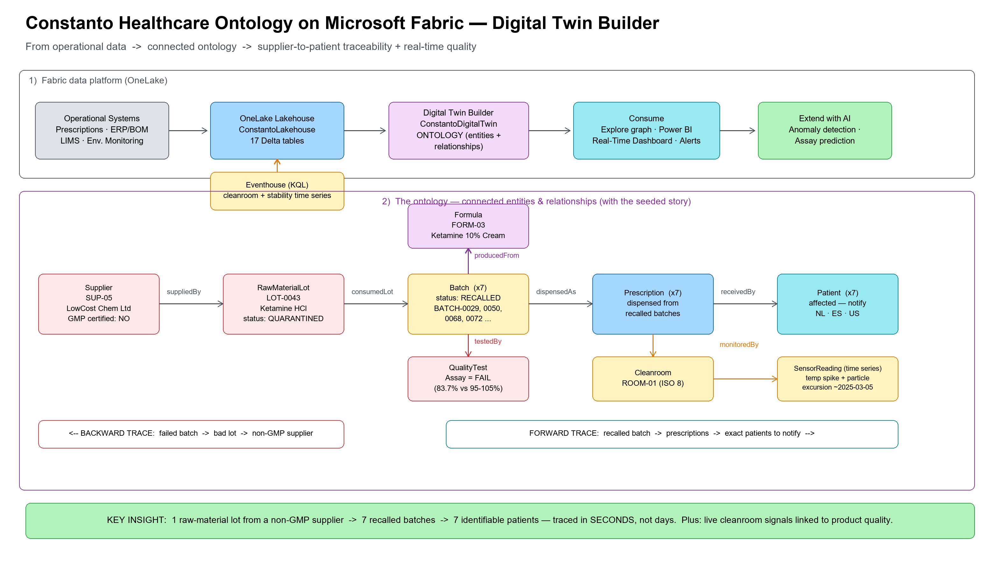
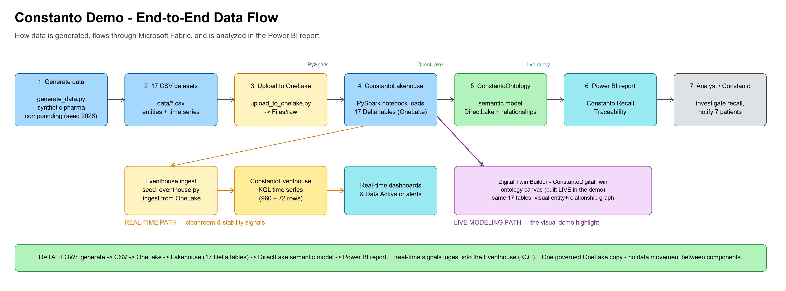
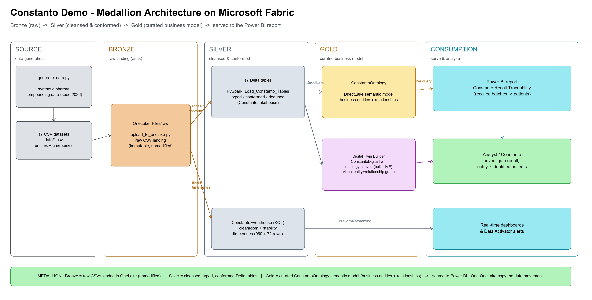

# Constanto Healthcare Ontology Demo — Microsoft Fabric Digital Twin Builder

A ready-to-present demo showing how **Microsoft Fabric Digital Twin Builder** turns
Constanto Pharma's disconnected pharmaceutical-compounding data into a single connected
**ontology** — enabling supplier-to-patient traceability and real-time environmental
quality insight.

> **Everything here is fictional.** *Constanto Pharma* is an invented company and all
> data is **synthetically generated** — no real patients, suppliers, batches or customer
> information. Fabric item IDs are placeholders (`<WORKSPACE_ID>`, `<LAKEHOUSE_ID>`, …);
> fill in your own after provisioning.

> **Built and live in your tenant.** The data foundation is already provisioned in
> Microsoft Fabric (Contoso tenant, F64 capacity). You build the ontology on the Digital
> Twin Builder canvas live during the demo (~10 min) — that's the visual highlight.

## How it all connects (one picture)



*Editable source: `docs/constanto-ontology-diagram.excalidraw` — open at https://aka.ms/excalidraw.*

### How data flows (generation → Fabric → Power BI)



*Editable source: `docs/constanto-dataflow-diagram.excalidraw`. Shows the pipeline from the
synthetic data generator through OneLake, the Lakehouse, the DirectLake semantic model,
and into the Power BI report — plus the real-time (Eventhouse) and live Digital Twin
Builder paths.*

### Medallion architecture view (Bronze → Silver → Gold)



*Editable source: `docs/constanto-medallion-diagram.excalidraw`. The same flow framed as a
medallion lakehouse: **Bronze** = raw CSVs landed in OneLake (immutable), **Silver** =
cleansed/typed/conformed Delta tables, **Gold** = curated ConstantoOntology semantic model
(business entities + relationships), then **served** to the Power BI report. Real-time
signals stream into the Eventhouse.*

## ⭐ START HERE — the 5-minute path

1. **Open the workspace:** https://app.fabric.microsoft.com/groups/<WORKSPACE_ID>
2. **Confirm the data is live:** open `ConstantoLakehouse` → you should see **17 tables**.
3. **Read one page:** `docs/03-demo-script.md` — it has the full run-of-show, the exact
   IDs to type, and copy-paste SQL that works even if the canvas misbehaves.
4. **Do the live highlight:** follow "Build the ontology" in `docs/02-fabric-setup-guide.md`
   to draw entities + relationships on the Digital Twin Builder canvas (~10 min).
5. **Land the punchline:** 1 bad supplier lot → 7 recalled batches → **7 identifiable
   patients**, traced in seconds. (Details below.)

> **Two forms of the ontology are provided:**
> - **ConstantoOntology** — a **built, queryable semantic model** (15 entities +
>   relationship graph, DirectLake). Works right now; open it in the workspace or build a
>   Power BI report on it. Verified: filtering `batch[status]="Recalled"` returns exactly
>   **7 affected patients** through the relationships.
> - **ConstantoDigitalTwin** — the Digital Twin Builder canvas you draw **live** (~10 min).
>   Same data, visual graph modeling. Its model is UI-only (no write API), so it starts
>   blank by design.

Everything else in this README is reference detail.

## What's provisioned in Fabric

Workspace: **Constanto-Healthcare-Ontology-Demo**
`https://app.fabric.microsoft.com/groups/<WORKSPACE_ID>`

| Item | Type | ID |
|---|---|---|
| Constanto-Healthcare-Ontology-Demo | Workspace | `<WORKSPACE_ID>` |
| ConstantoLakehouse | Lakehouse — 17 Delta tables | `<LAKEHOUSE_ID>` |
| ConstantoEventhouse | Eventhouse (KQL, time series) | `<EVENTHOUSE_ID>` |
| Load_Constanto_Tables | Notebook (reproducible loader) | `<NOTEBOOK_ID>` |
| ConstantoDigitalTwin | Digital Twin Builder (ontology) | `<DIGITAL_TWIN_ID>` |
| **ConstantoOntology** | **Semantic model — 15 entities + relationship graph (built, queryable)** | `<SEMANTIC_MODEL_ID>` |
| **Constanto Recall Traceability** | **Power BI report (built, verified) over ConstantoOntology** | `<REPORT_ID>` |

## The domain: pharmaceutical compounding

16 entity types spanning the compounding lifecycle — Patient, Prescriber, Prescription,
Formula, Ingredient, RawMaterialLot, Supplier, Batch, QualityTest, Pharmacy (Site),
Cleanroom, Equipment, Operator, plus two **time-series** entities (CleanroomSensorReading,
StabilityReading). See `docs/01-ontology-design.md`.

## The story the data tells

A deliberate scenario is seeded so the demo lands:

> **A non-GMP supplier's raw-material lot (`LOT-0043`, Ketamine HCl) caused 7 batches to
> fail assay and be recalled — affecting 7 identifiable patients across NL/ES/US.** A
> separate cleanroom environmental excursion (ROOM-01, ~2025-03-05) links environment to
> product quality.

Trace it **backward** (batch → lot → supplier) and **forward** (batch → prescription →
patient) in a few graph hops. Concrete IDs and SQL fallback queries are in
`docs/03-demo-script.md`.

## Documents (read in this order)

1. **`docs/01-ontology-design.md`** — the semantic model: entity types, relationships,
   the traceability graph, and the real-time angle.
2. **`docs/02-fabric-setup-guide.md`** — what's provisioned, how to rebuild, and the
   **step-by-step Digital Twin Builder canvas build** (the live part).
3. **`docs/03-demo-script.md`** — run-of-show with timings, narration, concrete IDs, and
   reliable SQL fallback queries.

## Repository layout

```
healthcare-ontology-demo/
  README.md
  docs/
    01-ontology-design.md
    02-fabric-setup-guide.md
    03-demo-script.md
  src/
    generate_data.py            # synthetic Constanto compounding data -> data/*.csv
    upload_to_onelake.py        # upload CSVs to Lakehouse Files/raw via OneLake
    create_and_run_notebook.py  # create + run PySpark loader -> 17 Delta tables
  data/                         # generated CSVs (17 files)
  fabric/                       # (reserved) exported Fabric item definitions
```

## Rebuild from scratch (if needed)

```powershell
cd C:\Workshops\healthcare-ontology-demo
python src\generate_data.py
$stg = az account get-access-token --resource "https://storage.azure.com" --query accessToken -o tsv
$fab = az account get-access-token --resource "https://api.fabric.microsoft.com" --query accessToken -o tsv
python src\upload_to_onelake.py $stg <WORKSPACE_ID> <LAKEHOUSE_ID>
python src\create_and_run_notebook.py $fab <WORKSPACE_ID> <LAKEHOUSE_ID> ConstantoLakehouse
```

## Pre-demo checklist

- [ ] Open the workspace and confirm the 5 items load
- [ ] Open ConstantoLakehouse → confirm 17 tables
- [ ] Open ConstantoDigitalTwin → confirm the empty canvas loads
- [ ] Skim `docs/03-demo-script.md` and have the SQL fallback queries ready in a tab
- [ ] Decide: build ontology fully live, or pre-build and re-narrate

## Notes

* Digital Twin Builder is in **preview**; the ontology canvas is UI-driven, so the
  entity/relationship modeling is done interactively (great for a live demo).
* All patient data is **synthetic** (no real PII) — safe to present.
* The Eventhouse is provisioned for an optional **real-time KQL / dashboard** extension
  of the cleanroom signals.
